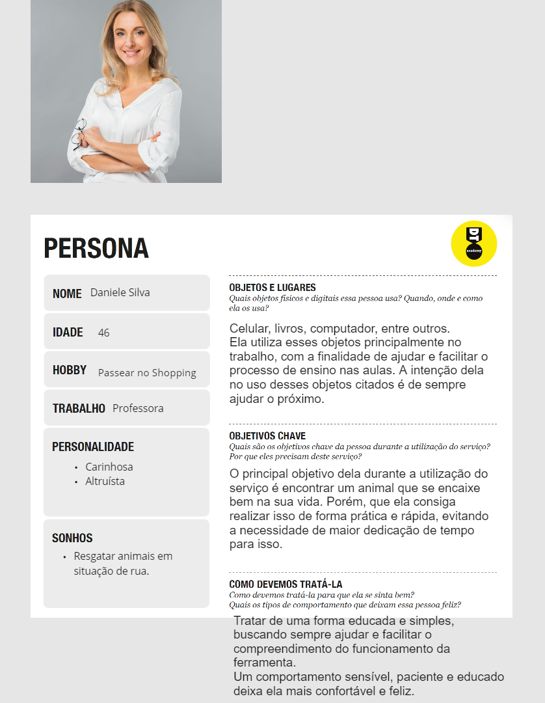
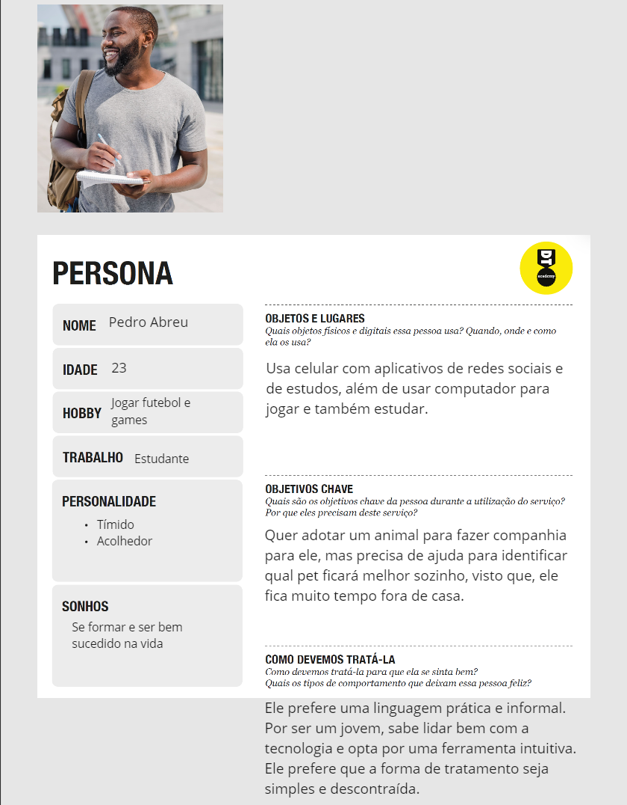
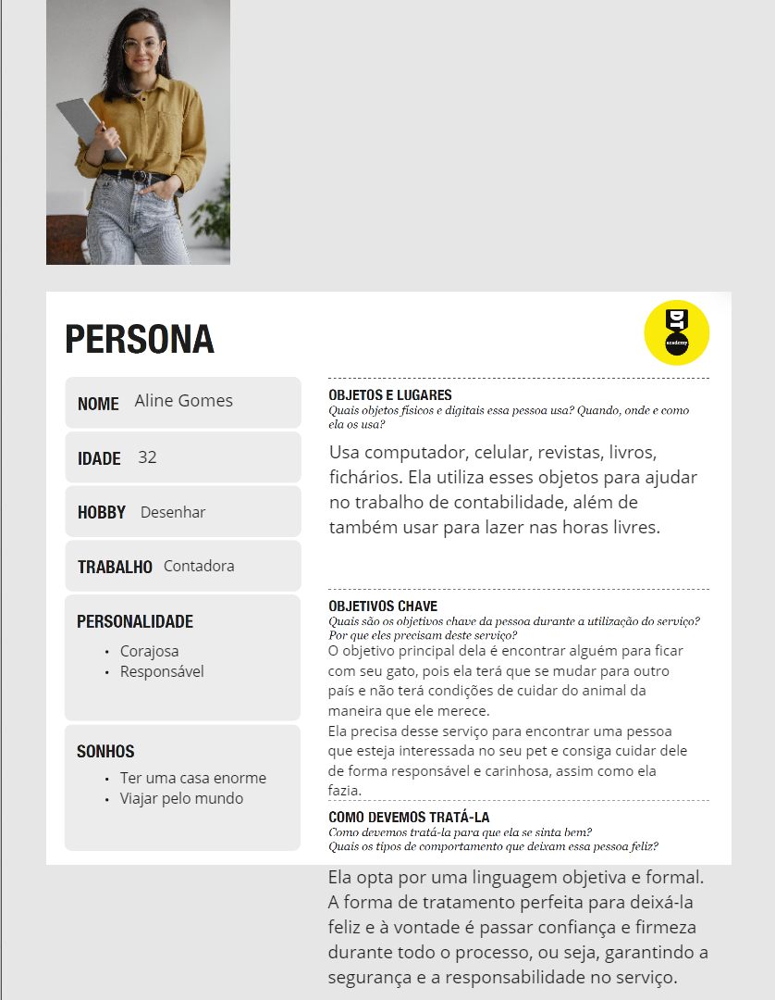
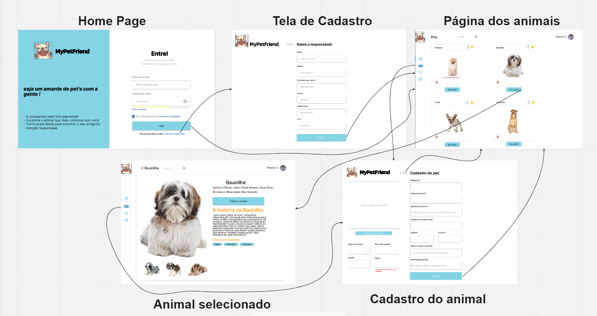
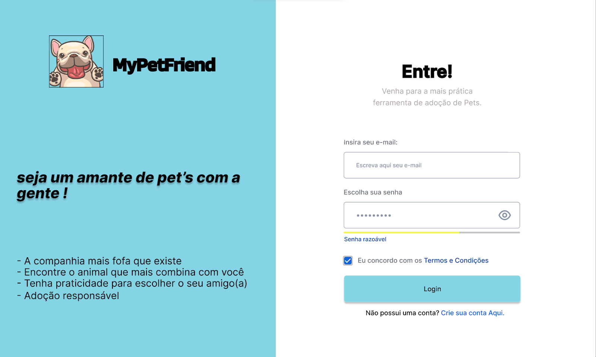
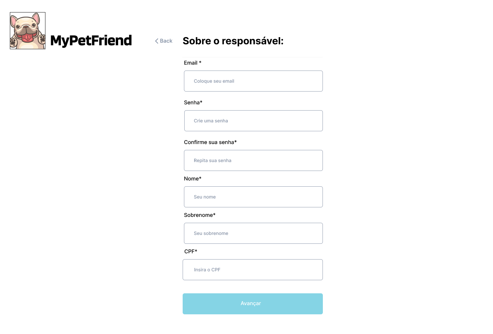
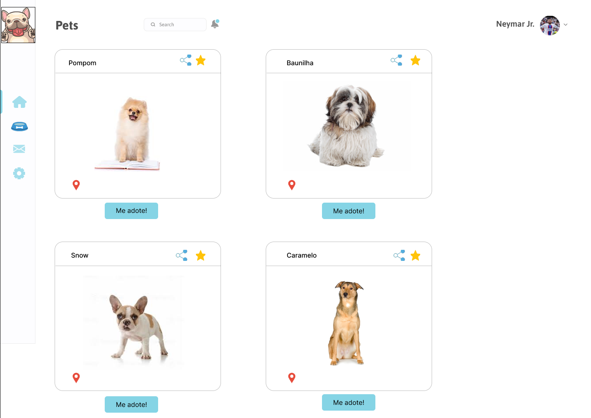
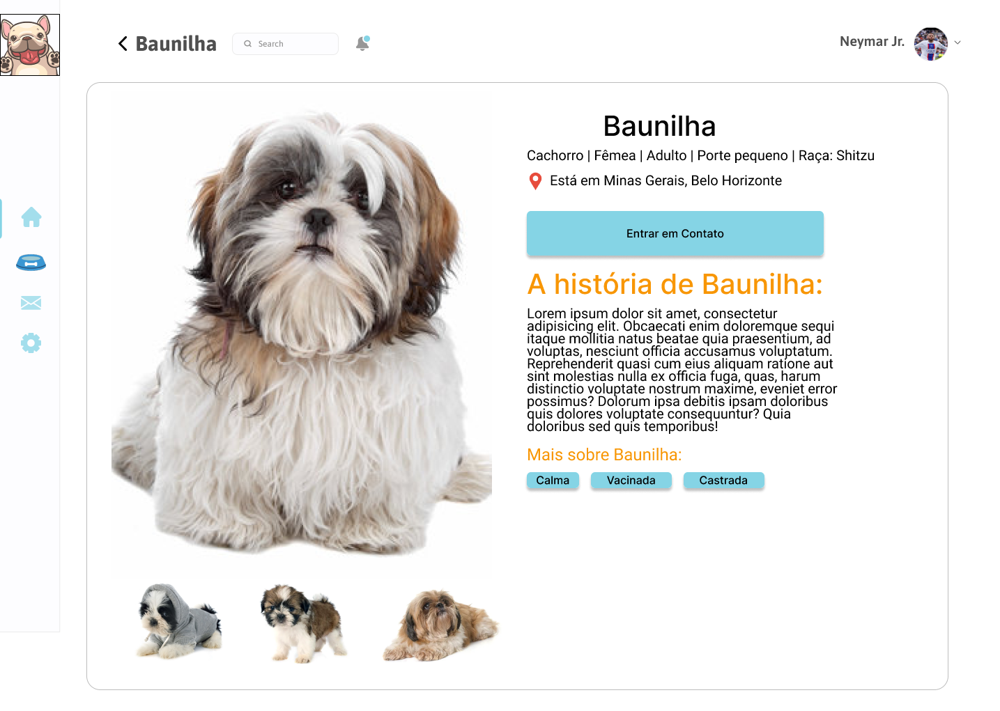
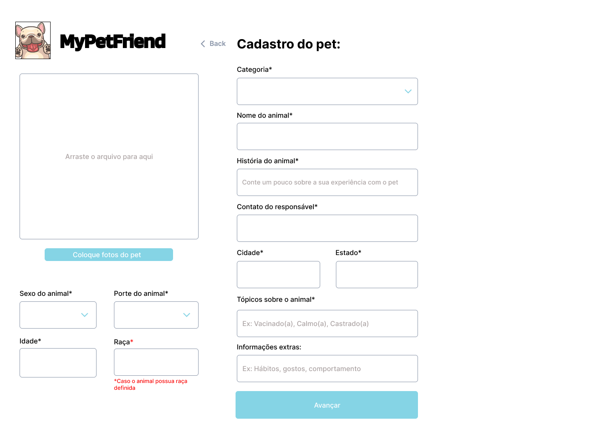
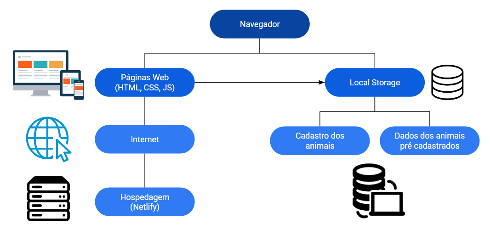

# Informações do Projeto
`TÍTULO DO PROJETO`  

  My Pet Friend

`CURSO` 

  Engenharia de Software 

## Participantes

Os membros do grupo são:
- Henrique Dani Franco Nezio
- Ryan Cristian Oliveira Rezende
- Pedro Henrique Lobato Firbida
- Lucca Oliveira Vasconcelos de Faria
- Matheus Pretti de Oliva
- Arthur George Souza Cardenas

# Estrutura do Documento

- [Informações do Projeto](#informações-do-projeto)
  - [Participantes](#participantes)
- [Estrutura do Documento](#estrutura-do-documento)
- [Introdução](#introdução)
  - [Problema](#problema)
  - [Objetivos](#objetivos)
  - [Justificativa](#justificativa)
  - [Público-Alvo](#público-alvo)
- [Especificações do Projeto](#especificações-do-projeto)
  - [Personas e Mapas de Empatia](#personas-e-mapas-de-empatia)
  - [Histórias de Usuários](#histórias-de-usuários)
  - [Requisitos](#requisitos)
    - [Requisitos Funcionais](#requisitos-funcionais)
    - [Requisitos não Funcionais](#requisitos-não-funcionais)
  - [Restrições](#restrições)
- [Projeto de Interface](#projeto-de-interface)
  - [User Flow](#user-flow)
  - [Wireframes](#wireframes)
- [Metodologia](#metodologia)
  - [Divisão de Papéis](#divisão-de-papéis)
  - [Ferramentas](#ferramentas)
  - [Controle de Versão](#controle-de-versão)
- [**############## SPRINT 1 ACABA AQUI #############**](#-sprint-1-acaba-aqui-)
- [Projeto da Solução](#projeto-da-solução)
  - [Tecnologias Utilizadas](#tecnologias-utilizadas)
  - [Arquitetura da solução](#arquitetura-da-solução)
- [Avaliação da Aplicação](#avaliação-da-aplicação)
  - [Plano de Testes](#plano-de-testes)
  - [Ferramentas de Testes (Opcional)](#ferramentas-de-testes-opcional)
  - [Registros de Testes](#registros-de-testes)
- [Referências](#referências)

# Introdução

## Problema

 Conforme exposto, o problema que se busca resolver com este projeto é a dificuldade nos processos para a adoção de pets, principalmente para aquelas pessoas interessadas em um animal de estimação que se encaixe no seu estilo de vida.

> Nesse momento você deve apresentar o problema que a sua aplicação deve
> resolver. No entanto, não é a hora de comentar sobre a aplicação.
> Descreva também o contexto em que essa aplicação será usada, se
> houver: empresa, tecnologias, etc. Novamente, descreva apenas o que de
> fato existir, pois ainda não é a hora de apresentar requisitos
> detalhados ou projetos.
>
> Nesse momento, o grupo pode optar por fazer uso
> de ferramentas como Design Thinking, que permite um olhar de ponta a
> ponta para o problema.
>
> **Links Úteis**:
> - [Objetivos, Problema de pesquisa e Justificativa](https://medium.com/@versioparole/objetivos-problema-de-pesquisa-e-justificativa-c98c8233b9c3)
> - [Matriz Certezas, Suposições e Dúvidas](https://medium.com/educa%C3%A7%C3%A3o-fora-da-caixa/matriz-certezas-suposi%C3%A7%C3%B5es-e-d%C3%BAvidas-fa2263633655)
> - [Brainstorming](https://www.euax.com.br/2018/09/brainstorming/)

## Objetivos

 O objetivo geral deste trabalho é a criação de uma plataforma de anúncios de animais de estimação que estejam necessitando de um novo lar. O site deve tornar o processo mais prático e eficiente, de forma que os usuários encontrem os pets ideais para sua rotina e que os animais encontrem uma casa acolhedora e segura.

 Como objetivos específicos, podemos ressaltar:
  - Disponibilizar informações bem específicas sobre os animais.
  - Facilitar a busca pelo animal ideal à rotina do usuário.
  - Tornar o processo de adoção mais simples, porém, mantendo a segurança do animal.

## Justificativa

 Vários estudos mostram que os animais de estimação são bons para a saúde das pessoas. Além disso, ter um pet em casa pode incentivar o exercício, melhorar a pressão arterial e ajudar no mental do dono evitando que mostre sinais de depressão, estresse ou ansiedade. 

 Mais motivos seriam:
  Garante um companheiro há todo momento.
  Ajudar a ter mais responsabilidade.
  Você estaria salvando uma vida.
  Alerta em situações de perigo.

## Público-Alvo

O público alvo do nosso projeto são aqueles que têm o interesse de adotar seu animal dos sonhos com facilidade. Assim como, aqueles que querem encontrar um novo lar para um Pet também.

Desta forma, estabeleceu-se como público-alvo desta solução ONG's e Pet Shops para anúncio de animais disponíveis para adoção, assim como homens e mulheres de 20 a 60 anos que tem interesse em adotar animais de forma facilitada e segura.

 
# Especificações do Projeto

 A definição exata do problema e os pontos mais relevantes a serem tratados neste projeto foi consolidada com a participação dos usuários em um trabalho de imersão feita pelos membros da equipe a partir da observação dos usuários em seu local natural e por meio de entrevistas. Os detalhes levantados nesse processo foram consolidados na forma de personas e histórias de usuários.

## Personas e Mapas de Empatia

Seguem abaixo as personas que representam os entrevistados através dos dados registrados:
  
 **Persona 1**:
 
 
 **Persona 2**:
 
 
 **Persona 3**:
 
 

## Histórias de Usuários

Com base na análise das personas forma identificadas as seguintes histórias de usuários:

|EU COMO... `PERSONA`| QUERO/PRECISO ... `FUNCIONALIDADE` |PARA ... `MOTIVO/VALOR`                 |
|--------------------|------------------------------------|----------------------------------------|
|Pedro Abreu         |Quer adotar um cachorro que         | Ele mora sozinho e gostaria de ter     | 
|                    |se adapte à sua rotina.             |alguém que esteja lhe esperando em casa,|
|                    |                                    |mas que se sinta bem mesmo estando      |
|                    |                                    | solitário.                             |
|------------------- |------------------------------------|----------------------------------------|
|José Antonio        |Já é dono de pet mas queria arranjar| José como fica fora muito tempo queria |
|                    |outro pet.                          |mais um pet para fazer companhia a seu  |
|                    |                                    |amigo enquanto está fora.               |
|------------------- |------------------------------------|----------------------------------------|
|Daniele Silva       |Queria encontrar um pet pequeno para| Daniele mora em um apartamento e queria|
|                    |cuidar em seu apartamento.          |um pet pequeno mas está na dúvida de    |
|                    |                                    |qual se encaixaria melhor na sua vida.  |
|------------------- |------------------------------------|----------------------------------------|
|Simone Aparecida    |Quer adotar um pet de forma barata  | Simone não possui a melhor condição    |
|                    |e fácil.                            |financeira e por isso não tem dinheiro  |
|                    |                                    |para comprar o gato dos sonhos.         |
|------------------- |------------------------------------|----------------------------------------|
|Matheus Torres      |Tem o sonho de ter um pomsky cinza. | Para lhe fazer companhia, mas          |
|                    |                                    |infelizmente o único canil de pomskys   |
|                    |                                    |atual é no Amapá                        |
|------------------- |------------------------------------|----------------------------------------|
|Gabriela Borba      |Queria doar seus gatos, pois deram  |Ela não tem onde deixá-los e não acha   |
|                    |crias.                              |ninguém para ficar com eles.            |
|------------------- |------------------------------------|----------------------------------------|

## Requisitos

As tabelas que se seguem apresentam os requisitos funcionais e não funcionais que detalham o escopo do projeto.

### Requisitos Funcionais

|ID    | Descrição do Requisito                  |Prioridade|
|------|-----------------------------------------|----------|
|RF-001| O site deve apresentar uma maneira de   | ALTA     | 
|      |registrar de forma limpa as informações  |          |
|      |do pet que você quer doar.               |          |
|------|-----------------------------------------|----------|
|RF-002| O site pode conter notícias sobre o     | BAIXA    |
|      |mundo animal.                            |          |
|------|-----------------------------------------|----------|
|RF-003|O site deve trazer em sua página         |          |
|      | principal os animais cadastrados.       | ALTA     |
|      |                                         |          |
|------|-----------------------------------------|----------|
|RF-004|O site deve ter uma página destinada para| MÉDIA    |
|      |cada animal que foi apresentado em sua   |          |
|      |tela principal.                          |          |
|------|-----------------------------------------|----------|
|RF-005|O site deve trazer uma página de suporte | MÉDIA    |
|      |para que o usuário entre em contato com a|          |
|      |equipe de desenvolvimento para reportar  |          | 
|      |qualquer problema.                        |          |
|------|-----------------------------------------|----------|
|RF-006| O site pode conter um chat com o doador | BAIXA    |
|      |para poder trocar informações.           |          |
|------|-----------------------------------------|----------|
|RF-007|O site deve oferecer uma forma de contato| ALTA     |
|      |com o anunciante da doação daquele animal|          |
|      |específico.                              |          | 
|------|-----------------------------------------|----------|
|RF-008| O site deve obter sua preferência de pet| BAIXA    |
|------|-----------------------------------------|----------|

### Requisitos não Funcionais

|ID     | Descrição do Requisito        |Prioridade|
|-------|-------------------------------|----------|
|RNF-001|O site deve ser publicado em um|          | 
|       |ambiente acessível publicamente|          |
|       |na Internet                    |   ALTA   |
|       |(Repl.it, GitHubPages);        |          |
|-------|-------------------------------|----------|
|RNF-002| O site deverá ser responsivo  |          | 
|       |permitindo a visualização em um|   MÉDIA  |
|       |celular de forma adequada      |          |
|-------|-------------------------------|----------|
|RNF-003| O site deve ter bom nível de  |          | 
|       |contraste entre os elementos da|   ALTA   |
|       |tela em conformidade           |          |
|-------|-------------------------------|----------|        
|RNF-004| O site deve ser compatível com|          |
|       |os principais navegadores do   |   ALTA   |
|       |mercado.                       |          |
|-------|-------------------------------|----------|

## Restrições

O projeto está restrito pelos itens apresentados na tabela a seguir.

|ID| Restrição                                             |
|--|-------------------------------------------------------|
|01| O projeto deverá ser entregue no final do semestre    |
|  |não podendo extrapolar a data de 10/12/2022.           |
|02| O aplicativo deve se restringir às tecnologias básicas|
|  |da Web no Frontend                                     |
|03| A equipe não pode subcontratar o desenvolvimento do   |
|  |trabalho.                                              |
|--|-------------------------------------------------------|

# Projeto de Interface

 Dentre as preocupações para a montagem da interface do sistema, estamos estabelecendo foco em questões como agilidade, acessibilidade e usabilidade. Desta forma, o projeto tem uma identidade visual padronizada em todas as telas que são projetadas para funcionamento em desktops e dispositivos móveis.
 
 O link do projeto de interface interativo do My Pet Friend está disponível no seguinte link: https://www.figma.com/file/DC6DRkF79dKUSaFlxu6zAi/MyPetFriend?node-id=0%3A1

## User Flow
 
> 

## Wireframes
 
 **Home Page**:

**Tela de Cadastro**:

**Página dos Animais**:

**Animal Selecionado**:

**Cadastro do Animal**:

# Metodologia

 Para organização e distribuição das tarefas do projeto, a equipe está utilizando o Trello estruturado com as seguintes listas: 

  - Recursos para Projetos: esta lista mantém um template de tarefas recorrentes com as configurações padronizadas que todos devem seguir. O objetivo é permitir a cópia destes templates para agilizar a criação de novos cartões.
  - Perguntas para a próxima reunião: Recebe ideias que os integrantes tiveram durante o dia a dia e que devem ser apresentadas durante a próxima reunião devem ser incorporadas a esta lista.
  - A fazer: Esta lista representa o Sprint Backlog. Este é o Sprint atual que estamos trabalhando.
  - Pendente: Quando uma tarefa tiver sido iniciada, mas que ainda não foi concluída, ela é movida para cá.
  - Concluído: nesta lista são colocadas as tarefas que passaram pelos testes e controle de qualidade e estão prontos para serem entregues ao usuário. Não há mais edições ou revisões necessárias, ele está agendado e pronto para a ação.

 O quadro kanban do grupo no Trello está disponível através da URL https://trello.com/invite/b/AhI2pIxE/94e50810cd26875e6f47a9c003419713/gestao-de-projetos. A definição desta estrutura se baseou na proposta feita por Littlefield (2016).

## Divisão de Papéis

 A equipe está organizada da seguinte maneira:
  - Scrum Master: Rommel Vieira Carneiro, Roberto Felipe Dias Ferreira da Rocha, Felipe Augusto Lara Soares
  - Product Owner: Rommel Vieira Carneiro, Roberto Felipe Dias Ferreira da Rocha, Felipe Augusto Lara Soares
  
  Equipe de Desenvolvimento:
  - Henrique Dani Franco Nezio(Desenvolvedor Front End)
  - Pedro Henrique Lobato (Desenvolvedor Back End)
  - Ryan Cristian(Analista de Mercado)
  - Matheus Pretti de Oliva (Designer)
  - Lucca Oliveira Vasconcelos de Faria (Designer)
  - Arthur George Souza Cardenas

## Ferramentas

|          Ambiente                | Plataforma |                                       Link de Acesso                                     |
|----------------------------------|------------|------------------------------------------------------------------------------------------|
|Documentos do projeto             |   GitHub   | https://github.com/ICEI-PUC-Minas-PPLES-TI/plf-es-2022-2-ti1-7924100-adocao              | 
|Repositório de código fonte       |   GitHub   | https://github.com/ICEI-PUC-Minas-PPLES-TI/plf-es-2022-2-ti1-7924100-adocao              | 
|Projeto de Interface e  Wireframes|   Figma    | https://www.figma.com/file/DC6DRkF79dKUSaFlxu6zAi/MyPetFriend?node-id=0%3A1              | 
|Gerenciamento do Projeto          |   Trello   | https://trello.com/invite/b/AhI2pIxE/94e50810cd26875e6f47a9c003419713/gestao-de-projetos | 
|----------------------------------|------------|------------------------------------------------------------------------------------------|

## Controle de Versão

 Para gestão do código fonte do software desenvolvido pela equipe, o grupo utiliza um processo baseado no Git Feature Branch Workflow, mostrado na Figura a seguir. Desta forma, todas as manutenções no código são realizadas em branches separados. Uma explicação rápida sobre este processo é apresentada no site "5 Git Workflows & Branching Strategy to deliver better code".
 A ferramenta de controle de versão adotada no projeto foi o [Git](https://git-scm.com/), sendo que o [Github](https://github.com) foi utilizado para hospedagem do repositório `upstream`.
 O projeto segue a seguinte convenção para o nome de branchs:
 - `master`: versão estável já testada do software
 - `unstable`: versão já testada do software, porém instável
 - `testing`: versão em testes do software
 - `dev`: versão de desenvolvimento do software
 
 Quanto à gerência de issues, o projeto adota a seguinte convenção para etiquetas:
- `bugfix`: uma funcionalidade encontra-se com problemas
- `enhancement`: uma funcionalidade precisa ser melhorada
- `feature`: uma nova funcionalidade precisa ser introduzida

> **GitHub Feature Branch Workflow**:
>
> 

# **############## SPRINT 1 ACABA AQUI #############**

# Projeto da Solução

Nessa seção são apresentados os passos de projeção da nossa solução.

## Tecnologias Utilizadas

- Visual Studio Code
- Páginas em HTML
- Estilos em CSS
- Dinamização das páginas com JavaScript
- Netlify para hospedagem

## Arquitetura da solução

Diagrama de Componentes
Os componentes que fazem parte da solução são apresentados na Figura que se segue.

A solução implementada conta com os seguintes módulos:
-Navegador - Interface básica do sistema 
-Páginas Web - Conjunto de arquivos HTML, CSS, JavaScript e imagens que implementam as funcionalidades do sistema.
-Local Storage - armazenamento mantido no Navegador, onde são implementados bancos de dados baseados em JSON. São eles:Cadastro dos animais, novos animais cadastrados   pelo usuário, Dados dos animais pré cadastrados e dados dos animais pré inseridos pelo grupo na intenção de deixar o site preenchido com conteúdo.
-Hospedagem - local na Internet onde as páginas são mantidas e acessadas pelo navegador. 

## Hospedagem
O site utiliza a plataforma do Netlify como ambiente de hospedagem do site do projeto. O site é mantido no ambiente da URL:
https://mypetfriendtiaw.netlify.app/

A publicação do site no Netlify é feita por meio de uma submissão do projeto (push) via git para o repositório remoto que se encontra no endereço: 
https://github.com/ICEI-PUC-Minas-PPLES-TI/plf-es-2022-2-ti1-7924100-adocao/tree/master/codigo/MyPetFriend

## Template do Site
O padrão de layout a ser utilizado pelo site tem grande parte correspondente ao projeto de Interface elaborado anteriormente, conforme Figura 6.

(images/TelaAnimais.png)

O template criado está disponível no site https://www.figma.com/file/DC6DRkF79dKUSaFlxu6zAi/MyPetFriend?node-id=0%3A1 e é composto pelos seguintes layouts:
-Tela principal (todos os animais)
-Tela de cadastro
-Blog
-Tela de suporte
-Tela de cada animal

A responsividade segue o padrão do Bootstrap.

# Funcionalidades do Sistema (Telas)
Nesta seção são apresentadas as telas desenvolvidas para cada uma das funcionalidades do sistema. O respectivo endereço (URL) e outras orientações de acesso são apresentadas na sequência.

## Cadastro de Animais (RF-01)
Aluno responsável: Henrique Dani Franco Nezio
A tela de cadastro do sistema apresenta os campos de informações necessárias para cadastrar com sucesso um novo animal. Os dados cadastrados são armazenados no LocalStorage com estruturas de dados baseados em JSON. Um exemplo da tela é apresentado na Figura 11.

(images/cadastroanimal.png)

Requisitos atendidos
RF-01 - O site deve apresentar uma maneira de registrar de forma limpa as informações do pet que você quer doar.

Artefatos da funcionalidade
- cadastro.html
- app.js
- LogoTIAW.png
- style.css

Estrutura de Dados
(images/estruturadados.png)

Instruções de acesso:
-Abra um navegador de Internet e informe a seguinte URL: https://mypetfriendtiaw.netlify.app/cadastro.html 
-A tela de cadastro será exibida pelo aplicativo após clicar no link acima.

## Apresentação dos animais cadastrados - Tela principal (RF-03)
Aluno responsável: Henrique Dani Franco Nezio
A tela principal permite ao usuário visualizar os animais pré cadastrados no localStorage do site, assim como ver os animais que foram cadastrados por ele.

(images/telaPrincipal.png)

Artefatos da funcionalidade
- index.html
- app.js
- style.css

Instruções de acesso
- Abra um navegador de Internet e informe a seguinte URL: https://mypetfriendtiaw.netlify.app/index.html ;
- A tela dos animais será exibida após clicar no link acima.

## Apresentação do animal selecionado - Tela principal (RF-03)
Aluno responsável: Lucca Oliveira Vasconcelos de Faria
A tela do animal selecionado na página principal permite ao usuário visualizar mais informações sobre aquele animal que ele selecionou.

(images/telaAnimal.png)

Artefatos da funcionalidade
- pagPet.html
- app.js
- style.css

Instruções de acesso
-Abra um navegador de Internet e informe a seguinte URL: https://mypetfriendtiaw.netlify.app/pagpet?id=1 ;
-A tela da Baunilha será exibida após clicar no link acima.
-Troque o valor de id na URL, exibida pelo navegador, por um valor de 1 até 4 (caso não tenha cadastrado nenhum animal) ou então por um valor de 1 até 4 + número de    animais que foram cadastrados.
-Você será redirecionado para a tela do animal com aquele id (identificador).
-Você também pode optar por voltar à tela principal, clicando no botão home da Navbar, e por lá entrar na página do animal que escolher.

## Blog (RF-02)
Aluno responsável: Pedro Henrique Lobato Firbida
O Blog traz notícias sobre o mundo animal e informações pertinentes aos queridos Pets.

(images/telaBlog1.png)

Artefatos da funcionalidade
- blog.html
- app.js
- style.css

Instruções de acesso:
- Abra um navegador de Internet e informe a seguinte URL: https://mypetfriendtiaw.netlify.app/blog.html ;
- O Blog será exibido pelo aplicativo após clicar no link acima.

## Tela de Suporte (RF-07)
Aluno responsável:Ryan Cristian Oliveira Rezende
A tela de suporte traz uma funcionalidade que possibilita que o usuário entre em contato com a equipe de desenvolvimento para reportar algum problema, bug ou experiência negativa dentro do site.

(images/telaSuporte.png)

Artefatos da funcionalidade
- reporte.html
- main.js
- style.css
- main.css

Instruções de acesso:
- Abra um navegador de Internet e informe a seguinte URL: https://mypetfriendtiaw.netlify.app/reporte.html ;
- A página de suporte será exibida pelo aplicativo após clicar no link acima.

# Avaliação da Aplicação

......  COLOQUE AQUI O SEU TEXTO ......

> Apresente os cenários de testes utilizados na realização dos testes da
> sua aplicação. Escolha cenários de testes que demonstrem os requisitos
> sendo satisfeitos.

## Plano de Testes

......  COLOQUE AQUI O SEU TEXTO ......

> Enumere quais cenários de testes foram selecionados para teste. Neste
> tópico o grupo deve detalhar quais funcionalidades avaliadas, o grupo
> de usuários que foi escolhido para participar do teste e as
> ferramentas utilizadas.
> 
> **Links Úteis**:
> - [IBM - Criação e Geração de Planos de Teste](https://www.ibm.com/developerworks/br/local/rational/criacao_geracao_planos_testes_software/index.html)
> - [Práticas e Técnicas de Testes Ágeis](http://assiste.serpro.gov.br/serproagil/Apresenta/slides.pdf)
> -  [Teste de Software: Conceitos e tipos de testes](https://blog.onedaytesting.com.br/teste-de-software/)

## Ferramentas de Testes (Opcional)

......  COLOQUE AQUI O SEU TEXTO ......

> Comente sobre as ferramentas de testes utilizadas.
> 
> **Links Úteis**:
> - [Ferramentas de Test para Java Script](https://geekflare.com/javascript-unit-testing/)
> - [UX Tools](https://uxdesign.cc/ux-user-research-and-user-testing-tools-2d339d379dc7)

## Registros de Testes

......  COLOQUE AQUI O SEU TEXTO ......

> Discorra sobre os resultados do teste. Ressaltando pontos fortes e
> fracos identificados na solução. Comente como o grupo pretende atacar
> esses pontos nas próximas iterações. Apresente as falhas detectadas e
> as melhorias geradas a partir dos resultados obtidos nos testes.

# Referências

......  COLOQUE AQUI O SEU TEXTO ......

> Inclua todas as referências (livros, artigos, sites, etc) utilizados
> no desenvolvimento do trabalho.
> 
> **Links Úteis**:
> - [Formato ABNT](https://www.normastecnicas.com/abnt/trabalhos-academicos/referencias/)
> - [Referências Bibliográficas da ABNT](https://comunidade.rockcontent.com/referencia-bibliografica-abnt/)
